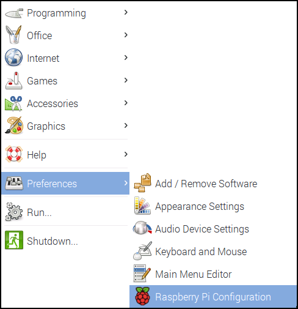

# Raspberry Pi Relay Timer

I've been doing a lot of relay-based projects lately; building several light timer projects. The first couple used Arduino-class devices, simple relays and provided the ability to set multiple on and off times throughout the day, just like those $10 power timers you can buy anywhere. These projects give me the ability to turn my Christmas lights at sundown and off when I go to bed, but not much more. 

What I really wanted though, is a way to have the lights turn on and off randomly (during specific time periods) to more accurately simulate me being home when I'm not. Products may exist that do this, but I've not seen any, so I decided to make my own. This repository contains the code for this project. 

> **Note**: You can use this code for your own, personal projects, but if you make a commercial product based on this concept, can you share the love (10% for example)? :-)

## Hardware Components

To use this project, you'll need at a minimum the following hardware components:

+ [Raspberry Pi 3](https://www.raspberrypi.org/products/raspberry-pi-3-model-b/)
+ A compatible relay/relay board (see below)
+ 5V, 2.5A Micro USB power source (basically, a smartphone charger) - I use the [CanaKit 5V 2.5A Raspberry Pi 3 Power Supply/Adapter/Charger](https://www.amazon.com/gp/product/B00MARDJZ4)
+ An enclosure for the Raspberry Pi and relay. 
 
For the relay, I used the [1-channel relay board](http://www.yourduino.com/sunshop/index.php?l=product_detail&p=181) from yourduino.com. The boards they're selling now are different than the ones I had lying around. They have a really good [relay tutorial](http://arduino-info.wikispaces.com/ArduinoPower) on their web site; even though it's geared primarily at Arduino users, it's still a lot of good information. Amazon.com also has a good [selection of relay boards](https://www.amazon.com/s/ref=nb_sb_noss_1?url=search-alias%3Daps&field-keywords=1+channel+relay) you can use as well.

## Configuring Your Raspberry Pi

Download the latest version of the Raspbian OS from the [Raspberry Pi web site](https://www.raspberrypi.org/downloads/raspbian/) and follow the [instructions](https://www.raspberrypi.org/documentation/installation/installing-images/README.md) for writing the OS image to a Micro SD card for the Pi. Insert the **SD card** in the Pi, connect **Ethernet**, **keyboard**, **mouse**, and a **monitor** to the Pi and finally **power it up** using a smartphone charger or some suitable power source.

The first thing you'll want to do is open the **Raspberry Pi menu** (in the upper-left corner of the screen), select **Preferences**, then **Raspberry Pi Configuration** as shown in the following figure:

Raspbian comes configured with its **keyboard**, **timezone**, and other **locale** settings configured for the United Kingdom (UK), so if you're in the US, or elsewhere that's not the UK, you'll want to switch over to the **localisation** tab and adjust the settings there as well.

When you're done configuring locale settings, you'll likely be prompted to reboot the Pi. Go ahead and do that before continuing. 

When the Pi comes back up, open a terminal window and execute the following command:

	sudo apt-get update

This updates the local catalog of application repositories. Next, execute the following command:

	sudo apt-get upgrade

This command updates the Raspbian OS with all updates released after the latest image was published. The update process may take a long time, so pay attention, answer any prompts, and expect this process to take a few minutes or more (the last time I did this, it took about 15 minutes or more to complete).

Next, install some Python libraries used by the project; in the same terminal window, execute the following command:

    sudo pip install pytz tzlocal numpy
        
Now, lets download and project code; still in the same terminal window (almost done now), execute the following command:

	git clone https://github.com/johnwargo/raspberry-pi-relay-timer

This downloads the project's code from its Github repository and copies the files to the local (relative to your terminal window) `raspberry-pi-relay-timer` folder.

Switch to the new folder by executing the following command:

	cd raspberry-pi-relay-timer

You'll find the following files in the folder:

+	`controller.py` - The project's main application file. You'll run this program to start the relay controller.
+	`LICENSE` - The MIT license for the application. You're free to use this code as you see fit, but, like I said, if you make a commercial product out of this, share the love (with me, of course).
+	`readme.md` - This file.
+	`relay.py` - A simple Python module that exposes the capabilities the application needs to control the relay. I broke this out into a separate module to make it easier for you to use my code in other projects.
+	`relay-test.py` - A Python application that I built to help me write and test the `relay.py` module. You can run it to make sure your hardware works correctly.
+	`solar-times.py` - A simple Python application I wrote to help me write and test the code that connects to a web service to determine sunrise and sunset times for the current location. This code is also in the `controller.py` file.
+	`start-controller.sh` - A shell script you'll use to configure the Pi to start the controller application on start up.

## Customizing the Controller Application

If you look in the project's `controller.py` file, you'll find an area neat the top of the file that contains configuration settings I'm expecting you to update to make this application work for your configuration. It will look something like this:

	# ============================================================================
	# User (that's you) adjustable variables
	# ============================================================================
	# adjust these variables based on your particular hardware configuration
	
I'll describe each of the settings components in the following sub-sections.

### Button Pin

The controller application basically runs a continuous loop, waiting for input or waiting for the minute to change so it can check to see if it needs to turn the relay on or off. Input is provided through a simple push button attached to the Raspberry Pi. Connect one of the button's wires to one of the GPIO pins, and connect the other to one of the Pi's ground (GND) pins. The GPIO Zero library used by the application takes care of setting up the Pi to read the button's status. The application doesn't know which pin you connected the button to, so you'll have to tell it by populating the application's `BUTTON_PIN` variable with the pin number for your implementation. In the example below, I have the button wired to the Pi's GPIO 19 pin.
 
	# set this variable to the button pin used in your implementation
	BUTTON_PIN = 19

### Relay Pin

The controller application basically runs a continuous loop, waiting for input or waiting for the minute to change so it can check to see if it needs to turn the relay on or off. For this project, you'll connect a simple relay to the Raspberry Pi using three wires. Connect the 5V output to the relay's VCC input. Connect one of the Pi's ground (GND) connectors to the relay's GND connector, and finally, connect one of the Pi's GPIO pins to the relay's IN1 connector. The GPIO Zero library used by the application takes care of setting up the Pi to drive the relay as an output device. The application doesn't know which pin you connected the relay to, so you'll have to tell it by populating the application's `RELAY_PIN` variable with the pin number for your implementation. In the example below, I have the relay wired to the Pi's GPIO 18 pin.

	# set this variable to the GPIO pin the relay is connected to
	RELAY_PIN = 18

### Location

The controller application uses a public web service to determine the daily sunrise and sunset times for your Pi's current location. Unfortunately, the Pi doesn't really know where it's physically located (yes, I know, you could determine a location using Wi-Fi SSID or IP address, but that won't always be accurate). The API I used for this application ([Sunrise Sunset](http://sunrise-sunset.org/api)), uses **latitude** and **longitude** values to determine the sunrise and sunset times. So, if you use one of the slot options (described later) that enables using solar times (sunrise and sunset), you'll have to provide latitude and longitude values for the Pi's current location by populating the `LOC_LAT` and `LOC_LONG` variables shown below. In the example, I have configured the controller to get solar times for Charlotte, NC.    

	# Sunrise and sunset times vary depending on location, so...
	# If using sunrise or sunset as trigger options, populate the locLat
	# and locLong values with the location's latitude and longitude values
	# These values are for Charlotte, NC, to get Sunrise/Sunset values for
	# your location, replace these strings with the appropriate values for
	# your location.
	LOC_LAT = "35.227085"
	LOC_LONG = "-80.843124"

> **Note**: The official name for our sun is Sol, so that's why I'm calling the controller's determining sunrise and sunset times as "getting Solar times". There's only one Sol in the universe, so even though you've seen it hundreds of times in the news and often in science fiction movies, there's only one Solar System. There is 'The Solar system' and there's no such thing as 'A Solar system.'  There's only one Solar System, you're in it.  

### Default Solar Times

When you configure the controller to use sunrise and sunset to turn on/off the relay, every morning at 12:01 AM, the application connects to the web service and asks it for the current sunrise and sunset values for the current location. If the network is not available for some reason, or the service isn't working at the time, the application needs some fallback values to use instead. With that in mind, the controller defines default values for **sunrise** and **sunset** (in the two variables shown below) that are reset to actual sunrise and sunset values the first time a successful call is made to the Sunrise Sunset API. After that first time, if the controller can't retrieve data from the web service, it merely uses the values from the previous successful call to the remote API.
   
	# default times for sunrise and sunset. If solar data is enabled, the
	# code will reach out every day at 12:01 and populate these values with
	# the correct values for the current day. If this fails for any reason,
	# the values will fall back to the previous day's values, or, finally,
	# these values
	time_sunrise = 700
	time_sunset = 1900

Time values here and in the `slots` variable described in the next section, are defined as integer vales in 24 hour format. So, 7:00 AM is represented as 700, and 5:00 PM is represented as 1700.

### Time Slots

I wanted to make the controller as flexible as possible without going too far. Ultimately, I'd love to make the controller's on/off times dynamically configurable using an app server running on the Pi and a smartphone or tablet application. Perhaps someday I'll get around to that, but for now, you have to manually configure the time slots in the controller's code.

The controller's `slots` array is a simple two-dimensional array; each row represents a single time slot, and columns in the row control:

+	On trigger
+	On adjustment value
+	Off trigger
+	Off adjustment value
+	A random flag 

Take a look at an example, then I'll explain how it works:

	# Slots array defines time windows and behavior for the relay
	# format: [ OnTrigger, OnValue, OffTrigger, OffValue, doRandom]
	slots = np.array(
	    # ONLY modify the following array with your time settings
	    [
	        (SETTIME, 700, SETTIME, 900, False),
	        (SETTIME, 1700, SETTIME, 2300, True),
	        (SUNRISE, 15, SUNSET, -10, True)
	    ],
	    # leave the rest of this alone
	    dtype=[
	        ('onTrigger', np.dtype(int)),
	        ('onValue', np.dtype(int)),
	        ('offTrigger', np.dtype(int)),
	        ('offValue', np.dtype(int)),
	        ('doRandom', np.dtype(bool))
	    ]
	)

The **On Trigger** and **Off Trigger** values identifies the event that triggers the relay to go on or off:

	# 'constants' that define the different time triggers used by the application
	# DO NOT MODIFY THESE, you'll mess up the app's logic
	SETTIME = -1
	SUNRISE = -2
	SUNSET = -3

Hopefully the purpose of each is clear, but just to make sure...

+	`SETTIME` instructs the controller to turn the relay on or off at a specific time. If `OnTrigger` is set to `SETTIME` then the value in `OnValue` defines the time used. Correspondingly, if `OffTrigger` is set to `SETTIME` then the value in `OffValue` defines the time used.
+	`SUNRISE` instructs the controller to use the current day's sunrise time to trigger the relay. If one of the triggers is set to `SUNRISE` then the value in `OnValue` defines a time offset added to the sunrise time. For example, if `OnTrigger` is set to `SUNRISE` and `OnValue` is 15, then the relay will turn on at 15 minutes **after** sunrise. if `OnTrigger` is set to `SUNRISE` and `OnValue` is -10, then the relay will turn on at 10 minutes **before** sunrise.  
+	`SUNSET` instructs the controller to use the current day's sunset time to trigger the relay. If one of the triggers is set to `SUNSET` then the value in `OnValue` defines a time offset added to the sunset time. For example, if `OnTrigger` is set to `SUNSET` and `OnValue` is 30, then the relay will turn on at 30 minutes **after** sunset. if `OnTrigger` is set to `SUNSET` and `OnValue` is -20, then the relay will turn on at 20 minutes **before** sunset.

Finally, the `doRandom` variable defines two options for the controller for each row:

+	`False` - The relay is turned on at on time and at off times calculated using `OnTrigger`, `OnValue`, `OffTrigger`, and `OffValue`
+	`True` - The relay is turned on and off at random times between on time and at off times calculated using `OnTrigger`, `OnValue`, `OffTrigger`, and `OffValue` 

So, when `doRandom` is enabled (`True`), the relay simulates a random human flipping the switch on and off in order to simulate you being home when you're actually not. 

> **Note**: Boolean values in Python are case sensitive; the possible values for `doRandom` are `True` and `False`. If you use `true` or `false` the controller won't work.

To configure the controller, define one or more array rows using the example shown above and the descriptions I just provided. When you execute the controller, at startup, it validates the slots and will tell you pretty quickly if things are OK. So, with that in mind, every time you make a change to these settings, make sure you check the controller's output window on startup to make sure everything's OK.

Instead of calculating whether the relay should be on or off with `doRandom` enabled, at 12:01 AM every day, the controller application builds a separate array of on/off times called `daily_slots`. This approach dramatically simplifies the overall code as all the controller has to do is query the `daily_slots` list to determine what it needs to do. The application doesn't do anything to validate that there's no overlap across slots, so if you define two time slots that contradict each other (one slot tells the controller to turn the relay on at the same time the other slot tells the controller to turn it off) the controller will do everything you tell it to do, and turn the relay on then immediately turn it off again.

> **Note**: You can see an example of the `daily_slots` list in the screen shot shown in the next section. In this example, there's two slots that have `doRandom` enabled, so the controller generates a random series of on/off time slots within the defined time windows. 

## Starting the Controller

Open a terminal window, and change to the project folder using the following command:

	cd raspberry-pi-relay-timer

Your terminal window prompt should change to reflect the switch to the new folder. Now, let start the server application. In the terminal window pointing to the `raspberry-pi-relay-timer` folder (you changed to this folder with the last command you typed), execute the following command:

	python ./controller.py

The controller process will start and begin managing the relay using the time slots you selected.

 
 
## Starting The Controller Server Process Automatically

Right now, the server is only running because you started it manually. There are a few steps you must complete to configure the Raspberry Pi so it executes the the relay controller app on startup. You can read more about this here: [Autostart Python App on Raspberry Pi in a Terminal Window](http://johnwargo.com/index.php/microcontrollers-single-board-computers/autostart-python-app-on-raspberry-pi-in-a-terminal-window.html).

If you don't already have a terminal window open, open one then navigate to the folder where you extracted the project files (if you followed these instructions, it should be at `home/pi/raspberry-pi-relay-timer`. If you're not there, get there. 

1.	Make the project's bash script file (`start-controller.sh`) executable by executing the following command:

    	chmod +x start-controller.sh
    
2.	Open the pi user's session autostart file using the following command:  

		sudo nano ~/.config/lxsession/LXDE-pi/autostart    

3.	Add the following line to the end (bottom) of the file:

		@lxterminal -e /home/pi/raspberry-pi-relay-timer/start-controller.sh

	To save your changes, press **ctrl-o** then press the Enter key. Next, press **ctrl-x** to exit the application.
  
4.	Reboot the Raspberry Pi; when it restarts, the controller server process should execute in its own terminal window.

## Update History

Nothing yet.

***
By [John M. Wargo](http://www.johnwargo.com) - If you find this code useful, and feel like thanking me for providing it, please consider making a purchase from [my Amazon Wish List](https://amzn.com/w/1WI6AAUKPT5P9). You can find information on many different topics on my [personal blog](http://www.johnwargo.com). Learn about all of my publications at [John Wargo Books](http://www.johnwargobooks.com). 